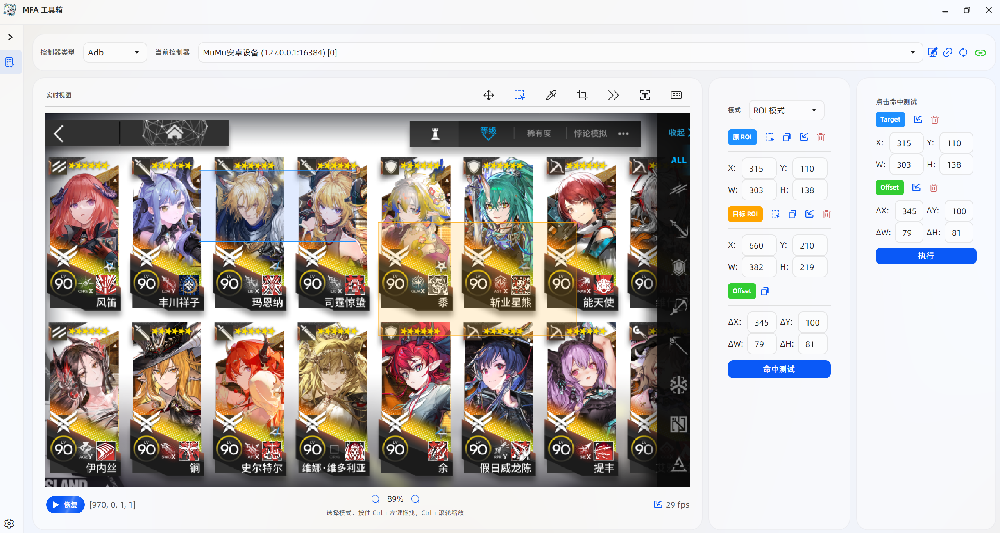

<!-- markdownlint-disable MD033 MD041 -->

  

# MFAToolsPlus

<!-- prettier-ignore-start -->
<!-- markdownlint-disable-next-line MD036 -->
_✨ MFA 工具箱 ✨_

**🚀 新一代跨平台自动化框架图形界面**

_基于 [Avalonia UI](https://github.com/AvaloniaUI/Avalonia)
构建的 [MaaFramework](https://github.com/MaaXYZ/MaaFramework) 新一代开发辅助工具_

<!-- prettier-ignore-end -->

## 📸 界面预览

  

